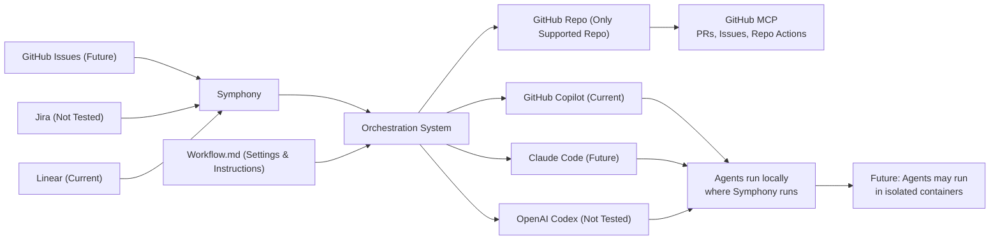

# Symphony .NET

A .NET 10 implementation of Symphony, an AI agent orchestration system based on [OpenAI's Symphony specification](SPEC.md)

> [!WARNING]
> Symphony is prototype software intended for evaluation and development purposes
> For production deployments, implement your own hardened version based on SPEC.md

## Overview

Symphony is an AI-powered agent that:

1. Polls Linear for candidate work items
2. Creates isolated workspaces for each issue
3. Launches Codex in [App Server mode](https://developers.openai.com/codex/app-server/) within the workspace
4. Executes workflow prompts to guide AI-driven development
5. Manages agent lifecycle until work is completed

The system automatically stops agents and cleans up workspaces when issues reach terminal states (Done, Closed, Cancelled, or Duplicate)



## Getting Started

### Prerequisites

- .NET 10 SDK installed
- Linear API token (set as LINEAR_API_KEY environment variable)
- Codex app-server installed and available in PATH

### Setup

1. Clone the repository:
   ```bash
   git clone https://github.com/khurram-uworx/symphony
   cd symphony
   ```

2. Set your Linear API key:
   ```bash
   # Windows PowerShell
   $env:LINEAR_API_KEY = "your_api_key_here"
   
   # Linux/macOS
   export LINEAR_API_KEY="your_api_key_here"
   ```

3. Build the project:
   ```bash
   dotnet build
   ```

### Running Symphony

Run the application with a workflow configuration file:

```bash
dotnet run --project src/Symphony.App/Symphony.App.csproj -- path/to/WORKFLOW.md
```

If no path is provided, Symphony defaults to ./WORKFLOW.md

## Configuration

### Workflow File Format

Create a WORKFLOW.md file with YAML front matter and a Markdown prompt body:

```markdown
---
tracker:
  kind: linear
  project_slug: "YOUR_PROJECT_SLUG"
workspace:
  root: ~/symphony/workspaces
hooks:
  before_run: |
    # Optional setup commands
  after_run: |
    # Optional cleanup commands
agent:
  max_turns: 20
codex:
  command: codex app-server
---

You are working on a Linear issue {{ issue.identifier }}.

**Title:** {{ issue.title }}

**Description:** {{ issue.description }}

Please analyze the issue and implement a solution.
```

### Configuration Options

- **tracker.kind**: Set to linear
- **tracker.project_slug**: Your Linear project slug (found in project URL)
- **tracker.api_key**: Defaults to LINEAR_API_KEY environment variable
- **workspace.root**: Root directory for issue workspaces (expands ~)
- **agent.max_turns**: Maximum consecutive turns per agent invocation (default: 20)
- **hooks.before_run**: Shell commands to run before starting the agent
- **hooks.after_run**: Shell commands to run after agent completion
- **codex.command**: Command to launch Codex app-server

### Template Variables

The workflow prompt supports the following template variables:

- {{ issue.identifier }}: Issue key (e.g., "PROJ-123")
- {{ issue.title }}: Issue title
- {{ issue.description }}: Issue description
- {{ issue.state }}: Current state of the issue

## Project Structure

```
src/Symphony.App/
├── Program.cs                  # Application entry point
├── Agent/                      # AI agent execution
│   ├── AgentRunner.cs
│   └── *.cs
├── Config/                     # Configuration management
├── Domain/                     # Core domain models
├── Linear/                     # Linear API integration
├── Orchestration/              # Service orchestration
├── Workflows/                  # Workflow execution
├── Workspaces/                 # Workspace management
└── Utils/                      # Utility functions
```

## Environment Variables

- **LINEAR_API_KEY**: Linear personal API token (required)
- **SYMPHONY_WORKSPACE_ROOT**: Override default workspace root directory

## Development

### Building

```bash
dotnet build
```

### Running Tests

```bash
dotnet test
```

### Code Style

The project uses C# latest language features with:
- Implicit usings enabled
- Nullable reference types enabled
- Latest C# language version

## How It Works

### Agent Lifecycle

1. **Poll**: Continuously monitors Linear for unstarted issues
2. **Prepare**: Creates a dedicated workspace directory and runs setup hooks
3. **Execute**: Launches Codex app-server and executes the workflow prompt
4. **Iterate**: Manages multi-turn conversations until work is complete
5. **Cleanup**: Runs cleanup hooks and monitors for terminal states

### Workspace Management

Each issue gets an isolated workspace where:
- The target repository is cloned (via hooks.before_run)
- All agent interactions are sandboxed
- Changes can be committed and pushed back to the repository
- Cleanup occurs after the agent completes

### Error Handling

The system gracefully handles:
- Workspace creation failures
- Hook execution failures
- Codex session failures
- Agent turn errors

All errors are logged with context for debugging.

## Contributing

Contributions are welcome! Please ensure:
- Code builds without warnings
- Tests pass
- Code follows the existing style conventions

## License

This project is licensed under the [Apache License 2.0](LICENSE)
